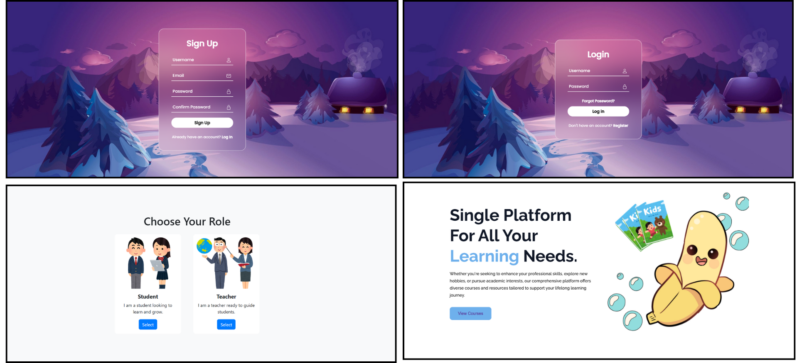
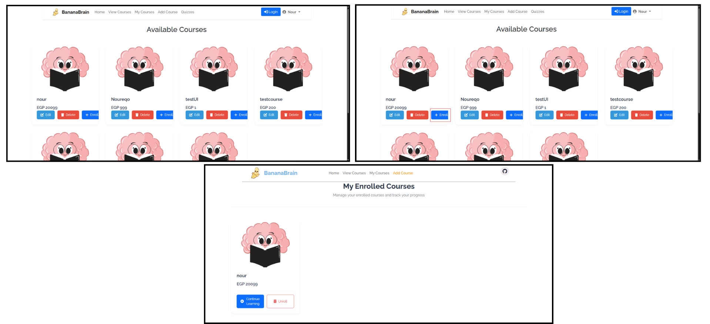
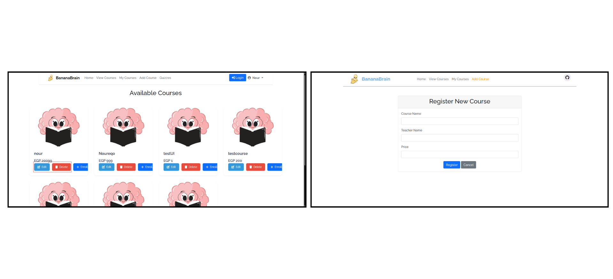
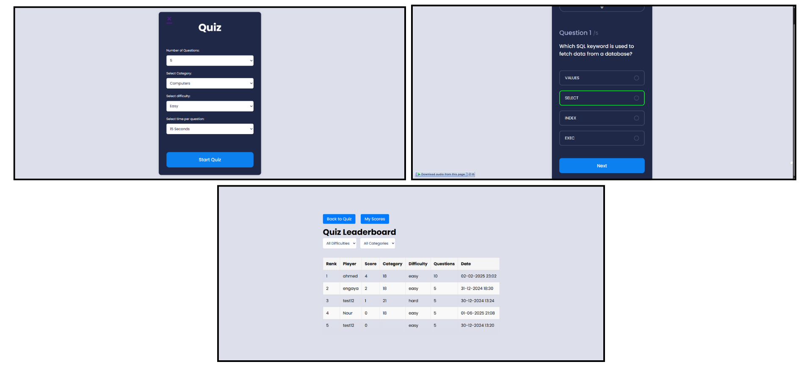

# Banana Brain Learning

An interactive online learning platform designed specifically for kids aged 5-12 years, offering gamified educational experiences through courses, quizzes, and rewards.

## Overview

Banana Brain Learning is an online system platform similar to Kahoot but on a smaller scale made with proper software desgin and OOAD principles Check [documentation](documentation/). It provides age-appropriate courses in subjects like history, science, mathematics, and general knowledge. The platform gamifies the learning experience with scores, ranks, and rewards, making education fun and engaging for young learners.
## Overview
- Linkedin Post: [Linkedin Post](https://www.linkedin.com/posts/noureldinabdelrazek_edtech-softwareengineering-education-activity-7335030820618866688-wB9X?utm_source=share&utm_medium=member_desktop&rcm=ACoAAERiVwMB65-IqkN3IM2hqzM1DVx7Q-JBaNo)
## Features

- User registration and authentication
- Course enrollment and management
- Interactive quizzes with immediate feedback
- Points-based ranking system
- Leaderboard showcasing performers
- Achievement badges for perfect quiz scores
- Age-appropriate content (5-12 years)

## Run Overview

- Sigup/Login Scenario
  

- Student Functionalities
  

- Teacher Functionalities
  

- Quizzes_and_Leaderboard
  

## Technical Specifications

### Performance

- Response time: < 3 seconds
- Concurrent users: Up to 50
- Navigation efficiency: 2-3 clicks from homepage

### System Requirements

- Internet connection
- Web browser
- Basic understanding of quiz navigation
