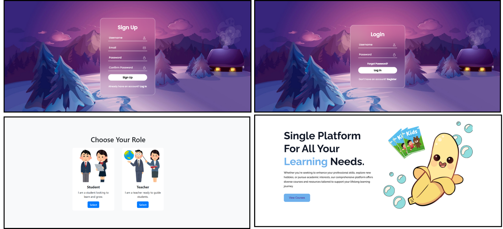
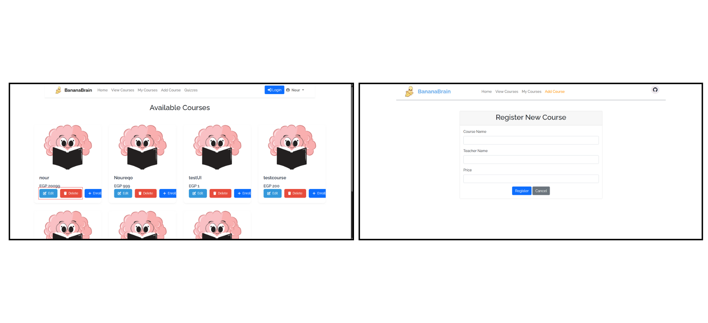

# Banana Brain Learning

An interactive online learning platform designed specifically for kids aged 5-12 years, offering gamified educational experiences through courses, quizzes, and rewards.

## Overview

Banana Brain Learning is an online system platform similar to Kahoot but on a smaller scale made with proper software desgin and OOAD principles Check [documentation](documentation/). It provides age-appropriate courses in subjects like history, science, mathematics, and general knowledge. The platform gamifies the learning experience with scores, ranks, and rewards, making education fun and engaging for young learners.

## Features

- User registration and authentication
- Course enrollment and management
- Interactive quizzes with immediate feedback
- Points-based ranking system
- Leaderboard showcasing performers
- Achievement badges for perfect quiz scores
- Age-appropriate content (5-12 years)

## Overview

- Sigup/Login Scenario
  

- Student Functionalities
  

- Teacher Functionalities
  

- Quizzes_and_Leaderboard
  

## Technologies

### Frontend
- HTML, CSS, JavaScript - Core web technologies
- Bootstrap - For responsive design and UI components

### Backend
- Java - Primary programming language
- Spring Boot - Java-based framework for building web applications
- Spring MVC - Web framework for handling HTTP requests

### Database
- PostgreSQL - Relational database

### Additional Tools
- Git - Version control system
- Gradle - Build automation tool
- JUnit - Testing framework

### System Requirements

- Internet connection
- Web browser
- Basic understanding of quiz navigation
