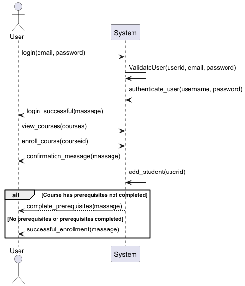
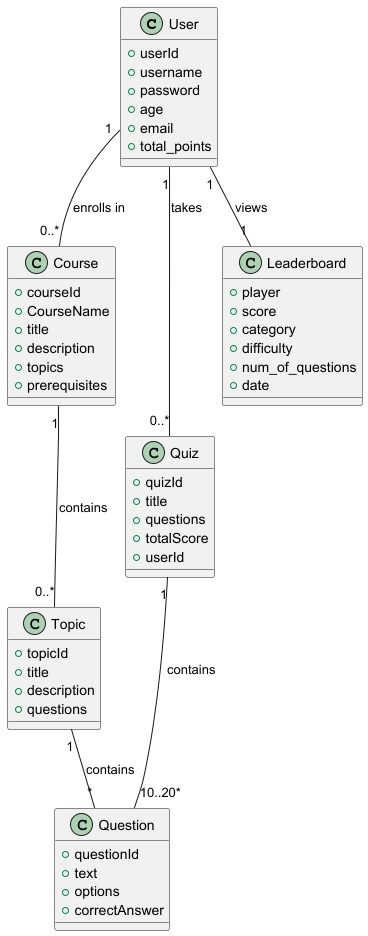
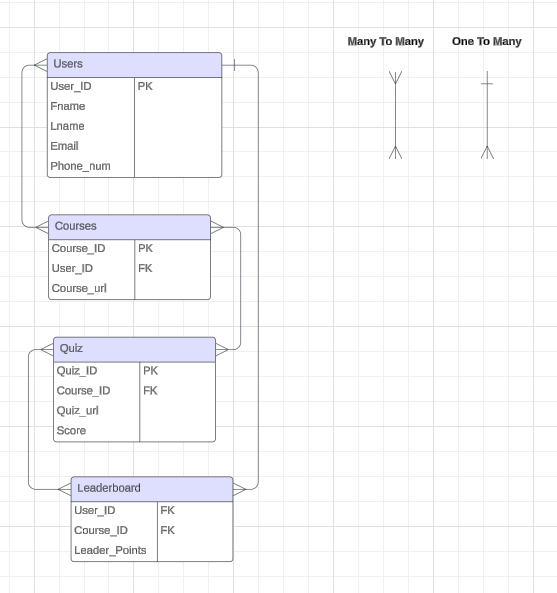
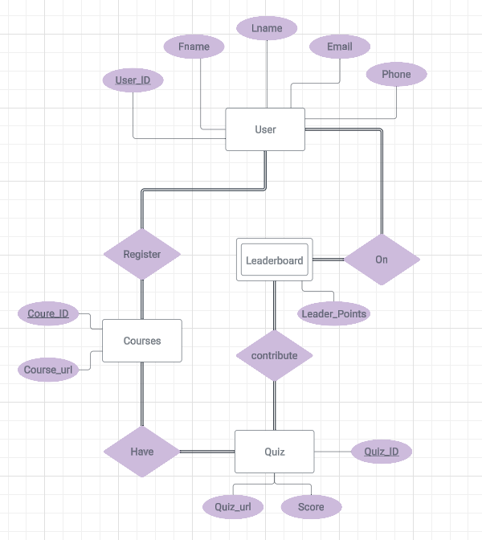

# Software Requirements Specification
## Banana Brain Learning
**Version 1.0**  
Prepared by:
- Mohamed Moataz (202201469)
- Mohamed Ramadan (202201773)
- Nour Eldin Mohamed Saber (202201310)

**Zewail City**  
**23/11/2024**

---

## Table of Contents
1. [Introduction](#introduction)  
   1.1 [Purpose](#11-purpose)  
   1.2 [Intended Audience](#12-intended-audience)  
   1.3 [Project Scope](#13-project-scope)
2. [Overall Description](#overall-description)  
   2.1 [Product Perspective](#21-product-perspective)  
   2.2 [Product Features](#22-product-features)  
   2.3 [User Classes and Characteristics](#23-user-classes-and-characteristics)  
   2.4 [Design and Implementation Constraints](#24-design-and-implementation-constraints)  
   2.5 [Assumptions](#25-assumptions)
3. [System Models](#system-models)  
   3.1 [Use Case Models](#31-use-case-models)  
   3.2 [Use Case Diagrams](#32-use-case-diagrams)  
   3.3 [Sequence Diagrams](#33-sequence-diagrams)  
   3.4 [Domain Models](#34-domain-models)

---

## 1. Introduction

### 1.1 Purpose
Banana Brain Learning is an online system platform that provides kids with an opportunity to enroll in courses and gain knowledge about topics by solving questions, earning rewards, and climbing ranks. The platform offers a fun, engaging, and competitive learning environment for kids aged 5 to 12 years.

This document describes the initial functional and non-functional requirements and includes graphical descriptions of the system such as:
- Use Case Diagrams
- Sequence Diagrams
- Domain Models

### 1.2 Intended Audience
The primary audience for this document includes:
- **Developers**: Implementing the software.
- **Stakeholders**: Reviewing functionalities and deciding on features for the project.

### 1.3 Project Scope
Banana Brain Learning is an online learning platform similar to Kahoot but on a smaller scale. It provides age-appropriate courses for topics such as history, science, mathematics, and general knowledge. Features include interactive quizzes, a ranking system, and a leaderboard for the top 3 kids with rewards for excellent performance.

---

## 2. Overall Description

### 2.1 Product Perspective
Banana Brain Academy enhances learning for kids by gamifying the process with scores and rank systems. It is useful for educators who wish to add interactivity to their courses.

### 2.2 Product Features

#### Functional Requirements:
1. The system shall allow users to view and enroll in courses.
2. Users shall be able to register (signup/login) for the platform.
3. Users can select topics related to a course.
4. Users shall be able to answer questions from a question bank.
5. Users shall be able to view answers to questions.
6. Users shall be able to take quizzes for a course.
7. Users shall be able to view quiz grades.
8. Users shall be able to view the leaderboard with the highest-ranked users.
9. Users can collect a badge for achieving a full mark in a quiz.

#### Non-Functional Requirements:
- **Response Time**: Maximum 3 seconds to process requests and load pages.
- **Usability**: Tasks should be achievable within 2-3 clicks from the homepage.
- **Performance**:
    - Support up to 50 concurrent users.
    - Maintain a below 3-second response time.
- **Maintainability**: The system should be modular to allow for extendable updates.

### 2.3 User Classes and Characteristics
- **Users**: Limited accessibility; can participate in courses and quizzes and get ranked based on performance.

### 2.4 Design and Implementation Constraints
- The project will be built using Java as an online web application.
- The web app will have a simple design and limited concurrent user handling.

### 2.5 Assumptions
1. The target users will be kids aged 5 to 12 years.
2. Kids will have a basic understanding of navigating and completing quizzes.
3. The app will comply with relevant laws, such as COPPA.

---

## 3. System Models

### 3.1 Use Case Models

### Use Case - User Registration (Signup)

| **Field**           | **Description**                                                                                       |
|---------------------|-----------------------------------------------------------------------------------------------------|
| **Use Case ID**     | UC-01                                                                                               |
| **Use Case Name**   | User Registration (Signup)                                                                          |
| **Actors**          | - **Main Actor**: User - **Secondary Actor**: System                                             |
| **Preconditions**   | - User has an internet connection. - User is on the registration page.                           |
| **Main Flow**       | 1. User enters required fields (name, password). 2. User clicks the "Sign Up" button. 3. System validates input fields. 4. User is routed to the login page. |
| **Alternative Flow**| - **3a**: If the name or password is invalid, an error message is displayed. - **3b**: Internet connection error occurs, preventing system communication. |
| **Postconditions**  | - An account is successfully created. - The user can log in.                                     |

---

### Use Case - Enroll in a Course

| **Field**           | **Description**                                                                                       |
|---------------------|-----------------------------------------------------------------------------------------------------|
| **Use Case ID**     | UC-02                                                                                               |
| **Use Case Name**   | Enroll in a Course                                                                                  |
| **Actors**          | - **Main Actor**: User - **Secondary Actor**: System                                             |
| **Preconditions**   | - User has a registered account. - User is logged in.                                            |
| **Main Flow**       | 1. User selects a course from the home menu. 2. User clicks the "Register Course" button. 3. System displays a confirmation message. 4. User clicks the "Confirm" button. 5. User is routed to the course content page. |
| **Alternative Flow**| - **2a**: If the course has prerequisites and the user hasn’t completed them, the system displays a message indicating the prior course must be completed first. |
| **Postconditions**  | - User is successfully enrolled in the course. - User can view the course content.               |

---

### Use Case - Take Quizzes

| **Field**           | **Description**                                                                                       |
|---------------------|-----------------------------------------------------------------------------------------------------|
| **Use Case ID**     | UC-03                                                                                               |
| **Use Case Name**   | Take Quizzes                                                                                        |
| **Actors**          | - **Main Actor**: User - **Secondary Actor**: System                                             |
| **Preconditions**   | - User is enrolled in a course. - Quizzes are available.                                         |
| **Main Flow**       | 1. User selects a course. 2. User clicks the "Start Quiz" button. 3. User answers all questions. 4. User clicks the "Submit Quiz" button. 5. System stores and evaluates the answers. 6. System displays the grade. |
| **Alternative Flow**| - **3a**: If not all questions are answered, the system displays: "Not all questions answered."      |
| **Postconditions**  | - Quiz is submitted. - The grade is displayed to the user.                                       |

---

### Use Case - View Leaderboard

| **Field**           | **Description**                                                                                       |
|---------------------|-----------------------------------------------------------------------------------------------------|
| **Use Case ID**     | UC-04                                                                                               |
| **Use Case Name**   | View Leaderboard                                                                                    |
| **Actors**          | - **Main Actor**: User - **Secondary Actor**: System                                             |
| **Preconditions**   | - User has a registered account. - There are users in the system with recorded points.            |
| **Main Flow**       | 1. User navigates to the leaderboard section. 2. The system fetches the leaderboard data, including top 3 students with the highest points. 3. The system displays the leaderboard. |
| **Alternative Flow**| - **3a**: If there are less than 3 students with points, the leaderboard will display: "Not enough students with banana points!" |
| **Postconditions**  | - The user can see the leaderboard. - The user can collect a badge if they are number 1 on the site. |

---

### 3.2 Use Case Diagram

### 3.3 Sequence Diagram

### 3.4 Domain Model

### 4.1 Schema

### 4.2 ERD

 
